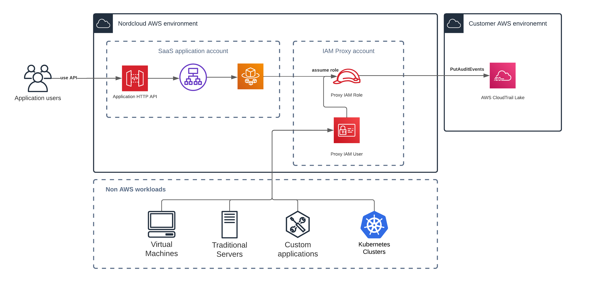

# IBM Multicloud CloudTrail Activity Events


- [IBM Multicloud CloudTrail Activity Events](#ibm-multicloud-cloudtrail-activity-events)
  - [AWS CloudTrail Activity Events](#aws-cloudtrail-activity-events)
    - [AWS CloudTrail partner](#aws-cloudtrail-partner)
    - [Event Schema](#event-schema)
    - [Getting started](#getting-started)
  - [IBM Multicloud](#ibm-multicloud)
    - [AWS CloudTrail integration](#aws-cloudtrail-integration)
    - [Enabling integration in AWS Console](#enabling-integration-in-aws-console)
    - [Enabling integration with AWS CLI](#enabling-integration-with-aws-cli)
    - [Disabling integration](#disabling-integration)
    - [Event Sources](#event-sources)
    - [Event Types](#event-types)
  - [Architecture](#architecture)
  - [Examples](#examples)
  - [Support](#support)

## AWS CloudTrail Activity Events

AWS CloudTrail Lake let you use CloudTrail to log and store user activity data from any source in your hybrid environments, such as in-house or SaaS applications hosted on-premises or in the cloud, virtual machines, or containers. You can store, access, analyze, troubleshoot and take action on this data without maintaining multiple log aggregators and reporting tools.

Once you get event data from third-party application or via `PutAuditEvents` API, you can create event data stores in AWS CloudTrail Lake, and use it to search, query, and analyze the data that is logged from your applications. To help you meet compliance resources this data is backed by a 7-year default retention period.

For more information, please refer to official [AWS documentation](https://docs.aws.amazon.com/).

### AWS CloudTrail partner

AWS CloudTrail Lake supports ingesting activity logs from the trusted entities like IBM Multicloud that is being an official AWS Partner in CloudTrail Lake activity events.

AWS and IBM Multicloud teams works together to deliver this integration allowing you to simplify the process of consolidating activity data. It enables the enhanced visibility across applications and environments. In a few steps you can consolidate IBM Multicloud activity logs together with AWS activity logs without having additional processing pipelines.

To get started with IBM Multicloud integration please refer to go to the [AWS CloudTrail integration](#aws-cloudtrail-integration) section.

### Event Schema

The following example shows the complete schema of event records that can be ingested to AWS CloudTrail Lake. The content of `eventData` is provided by the application that is publishing the event. Other fields are provided by AWS CloudTrail.

```json
{
  "eventID": "string",
  "eventVersion": "string",
  "eventCategory": "string",
  "eventType": "string",
  "eventTime": "string",
  "awsRegion": "string",
  "recipientAccountId": "string",
  "addendum": {
    "reason": "string",
    "updatedFields": "string",
    "originalUID": "string",
    "originalEventID": "string"
  },
  "metadata" : {
    "ingestionTime": "string",
    "channelARN": "string"
  },
  "eventData": {
    "version": "string",
    "userIdentity": {
      "type": "string",
      "principalId": "string",
      "details": { JSON }
    },
    "userAgent": "string",
    "eventSource": "string",
    "eventName": "string",
    "eventTime": "string",
    "UID": "string",
    "requestParameters": { JSON },
    "responseElements": { JSON },
    "errorCode": "string",
    "errorMessage": "string",
    "sourceIPAddress": "string",
    "recipientAccountId": "string",
    "additionalEventData": { JSON }
  }
}
```

For more information, please refer to official [AWS documentation](https://docs.aws.amazon.com/).

### Getting started

To receive CloudTrail Events from third-party application following actions are required:

1. Create Event Data Store in AWS CloudTrail Lake to store incoming events. You can do that by running the following API call:

    ```bash
    aws cloudtrail create-event-data-store \
      --name my-event-data-store \
      --region us-east-1 \
      --retention-period 30 \
      --no-multi-region-enabled \
      --advanced-event-selectors '[{
         "Name": "Select all external events",
         "FieldSelectors": [{ 
             "Field": "eventCategory", "Equals":["ActivityAuditLog"] 
         }]
      }]'
    ```

2. Create an ingestion channel to ingest events from a third-party application. You can do that by running the following API call:

    ```bash
    aws cloudtrail create-channel \
      --region us-east-1 \
      --name test \
      --source "Custom" \
      --destinations "[{
          \"Type\": \"EVENT_DATA_STORE\", 
          \"Location\": \"${DATASTORE_ARN}\"
      }]"
    ```

3. Apply Resource Based Policy to allow third-party application to publish activity events.

    ```bash
    aws cloudtrail put-resource-policy \
      --region us-east-1 \
      --resource-arn "${CHANNEL_ARN}" \
      --resource-policy "{
          \"Version\": \"2012-10-17\",
          \"Statement\": [{
              \"Sid\": \"ChannelPolicy\",
              \"Effect\": \"Allow\",
              \"Principal\": {
                  \"AWS\": [\"arn:aws:iam::${SOURCE_ACCOUNT_ID}:root\"]
              },
              \"Action\": [\"cloudtrail-data:PutAuditEvents\"],
              \"Resource\": [\"${CHANNEL_ARN}\"],
              \"Condition\": {
                  \"StringEquals\": {
                      \"cloudtrail:ExternalId\": \"${EXTERNAL_ID}\"
                  }
              } 
          }]
      }"
    ```

4. Activity events can now be ingested to your AWS CloudTrail Event Data Store with `PutAuditEvents` API call:

    ```bash
    aws cloudtrail-data put-audit-events \
      --channel-arn $CHANNEL_ARN \
      --region "us-east-1" \
      --external-id $EXTERNAL_ID \
      --audit-events "{
        \"id\": \"6df0f951-6f16-4e2b-adb4-ababba1edc53\",
        \"eventData\": \"{ ... }\"
      }"
    ```

The above configuration allows you to receive activity events from any third-party application. You can find working script example in [enable-custom-integration.sh](./examples/enable-custom-integration.sh) file. If you are interested in enabling integration with trusted Partner like **IBM Multicloud** please refer to the next section.

For more details, please refer to official [AWS documentation](https://docs.aws.amazon.com/).

## IBM Multicloud

IBM Multicloud was developed by Nordcloud, an IBM Company, the European leader in cloud migration, application development and managed services. We like to say IBM Multicloud is like autopilot for cloud management, because our goal is to help businesses manage cloud costs, automate operations, improve security and accelerate development with no manual work.

Currently, there are four IBM Multicloud services in the toolkit:

- [IBM Multicloud Accelerator](https://klarity.nordcloud.com/products/klarity-core/)
- [IBM Multicloud AutoPatcher](https://klarity.nordcloud.com/products/klarity-autopatcher/)
- [IBM Multicloud AutoBackup](https://klarity.nordcloud.com/products/klarity-autopatcher/)
- [IBM Multicloud Machine Image Toolkit](https://klarity.nordcloud.com/products/klarity-imagefactory/)

Together, this suite of cloud management tools gives you the facts you need to understand and optimize your cloud costs, infrastructure, security and data, empowering you to make strategic business decisions.

### AWS CloudTrail integration

IBM Multicloud is integrated directly with Cloud Trail Lake to store and monitor customer tenant activity. You can enable this integration to receive logs on activities in your application tenant. Events published by the IBM Multicloud can be related to the actions performed by applications on customer cloud environments or any other tenant activity.

Ingested events are stored in the customer AWS account in Cloud Trail Lake Data Store. Customers can run queries or any other processing on this data.

Example use cases for using Cloud Trail Events:

- Monitor user activity on application tenant.
- Store and analyze tenant configuration changes.
- Monitor actions executed by the SaaS application on customer AWS accounts or any other environment used by the application.
- Ensure company compliance by directly accessing all events produced by a third-party application.

***IBM Multicloud is an AWS partner in AWS CloudTrail Lake integration. It makes it a trusted source of events and simplifies the integration process.***

### Enabling integration in AWS Console

IBM Multicloud is AWS Partner in AWS CloudTrail Lake so it should be possible to easily enable this integration in AWS Console.

Please navigate to AWS CloudTrail console where you have a CloudTrail Lake event data store enabled. You will be guided on how to enable integration by selecting Nordcloud from the list of AWS CloudTrail partners. You can select existing event data store or create new one. The External ID property should be filled with the unique identifier provided by the IBM Multicloud support. Please contact directly with your CSM to receive this.

Please note that when enabling integration in AWS Console AWS automatically creates the Resource Based Policy allowing IBM Multicloud to send events to your ingestion channel. You do not need to grant any other permissions to make it working.

For more information, please refer to official [AWS documentation](https://aws.amazon.com/blogs/aws/new-aws-cloudtrail-lake-supports-ingesting-activity-events-from-non-aws-sources/).

Once you have enabled integration with Nordcloud please contact with your CSM and provide following information:

- Ingestion channel ARN
- List of IBM Multicloud services you want to enable integration with

Please note that at the beginning not all IBM Multicloud services implements AWS CloudTrail activity events. This will be delivered based on our roadmap and customer requirements. To ask for feature availability please contact with your CSM.

### Enabling integration with AWS CLI

Integration with IBM Multicloud can be enabled with AWS CLI as well. However you will have to create the correct Resource Based Policy on your own. The full example can be found in [enable-ibm-multicloud-integration.sh](./examples/enable-ibm-multicloud-integration.sh) file.

### Disabling integration

To disable integration simply navigate to the AWS CloudTrail Lake console and delete integration with IBM Multicloud. Your data store won't receive any more events from IBM Multicloud and we won't be able to publish them.

To delete integration with API call you can run following command:

  ```bash
  aws cloudtrail delete-channel \ 
    --channel $CHANNEL_ARN
  ```

### Event Sources

A single and unique event source is reserved for each of IBM Multicloud service. Currently, we we have secured the following event sources:

| Service name | Event Source | Integration enabled |
|---|---|:---:|
| IBM Multicloud Accelerator | com.nordcloudapp.klarity | ❌ |
| IBM Multicloud AutoBackup | com.nordcloudapp.autobackup | ❌ |
| IBM Multicloud AutoPatcher | com.nordcloudapp.autopatcher | ❌ |
| IBM Multicloud Machine Image Toolkit | com.nordcloudapp.imagefactory | ✅ |
| IBM Multicloud Maestro | com.nordcloudapp.maestro | ✅ |

Please note that the above list may change in the future once we add new service to the IBM Multicloud.

❌ - *The Event source name is reserved for the application but integration is not yet fully implemented.*
✅ - *Integration is fully implemented.*

### Event Types

Event types define the activity that happened on the application tenant or operation executed by the application in the cloud environment. Every IBM Multicloud service has its own uniq set of events depending on the functionality. Please check the application specific documentation in the [event-sources](https://github.com/nordcloud/cloudtrail-activity-events/tree/main/event-sources) directory for more details.

## Architecture



## Examples

As an example, the following activity event is produced by the IBM Multicloud Accelerator as an result of creating new discovery rule in `test env` environment by `name@example.com` user.

```json
{
    "eventData": {
        "version": "v1",
        "userIdentity": {
            "type": "USER",
            "principalId": "name@example.com"
        },
        "eventSource": "com.nordcloudapp.com.klarity",
        "eventName": "discoveryRule.created",
        "eventTime": "2022-07-12T10:55:00",
        "UID": "00000000-00000000-00000000-00000000",
        "requestParameters": {
            "ruleName": "rule name",
            "ruleId": "00000000-00000000-00000000-00000001",
            "environment": "test env",
            "application": "test app"
        }
    }
}
```

You can find a documentation on all activity events produced by the IBM Multicloud tools in the [event-sources](https://github.com/nordcloud/cloudtrail-activity-events/tree/main/event-sources) directory.

## Support

To get support on the IBM Multicloud CloudTrail integration please contact with your CSM directly.

We strongly encourage you to leave us a feedback regarding this functionality. New applications and events are going to be delivered based on customer demands.
